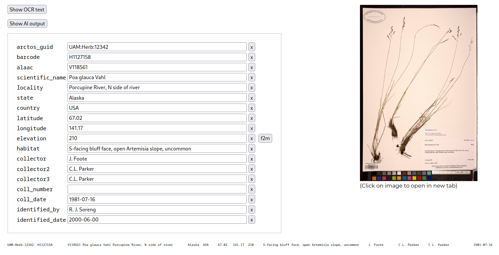

# Label AI

_Simple web app using AI to OCR and parse herbarium specimen labels_

This script provides a simple HTML UI to access the
[EdenAI](https://www.edenai.co/) APIs. It uses: i) Google to OCR an
image (deals with handwriting well), ii) (optionally) Google to
translate the OCR text into English, and iii) OpenAI’s Generative Text
AI (related to ChatGPT) to parse the OCR into Darwin-Core-ish fields.
These are loaded into a HTML form where they can be edited. Finally, a
tab-delimited text string can copied and pasted into text editor and
opened by a spreadsheet/DB.

As input, the app can either take a ID (e.g., a Museum accession
number) and use a lookup table from IDs to Image URLs, or a
directly uploaded image.  The former permits the app to be run on a
local machine. Using the latter requires a public webserver with
server write-permission to a directory in which the uploaded images
are stored.

**Note**: If you put this app on a public server, and do not want to
subsidize the public with your payments to EdenAI, use Basic
Authentication to password protect the site.

## Installation

_This script is a quick hack and you might do better to rewrite
something similar with your platform of choice. But it does work._

 * Dependencies: **Gawk** and
   [gawkextlib](https://gawkextlib.sourceforge.net/), with the Json
   extension. On Arch Linux, packages `gawk`, `gawkextlib` (AUR) and
   `gawk-json` (AUR). Plus an HTTP **web server**, e.g., Apache.
 * Clone the repo somewhere the web server can see and execute the
   directory
 * `$ cp .htaccess.template .htaccess`
 * If using Basic Authentication, create a password file with `htpasswd`
 * Edit `.htaccess` as needed (e.g., to set password file or disable Auth)
 * Get an EdenAI account and API key
 * `$ cp pw_template.awk pw.awk`
 * Add the API key to `pw.awk`, and the _relative_ path of a
   web-readable, server-writable directory where the uploaded images
   can be stored.
 * Make that directory: `$ mkdir ../aiimg && chmod a+w ../aiimg`
   (`../aiimg` is an example)
 * (optionally) Create a space-delimited, two column lookup table: `ID
   URL` called `guid2url`

## Acknowledgments

Thanks to Debbie Paul for pointing me to a
[Github thread](https://github.com/tdwg/dwc/issues/32#issuecomment-1344768511)
where she asked ChatGPT to parse label text into JSON, and also for
pointing me to the TDWG Slack `#ai` channel, where I see others
([Rod Page](https://twitter.com/rdmpage/status/1642867875424641025),
[Rukaya](https://github.com/gbif-norway/label-classification-gpt))
have also been experimenting.

